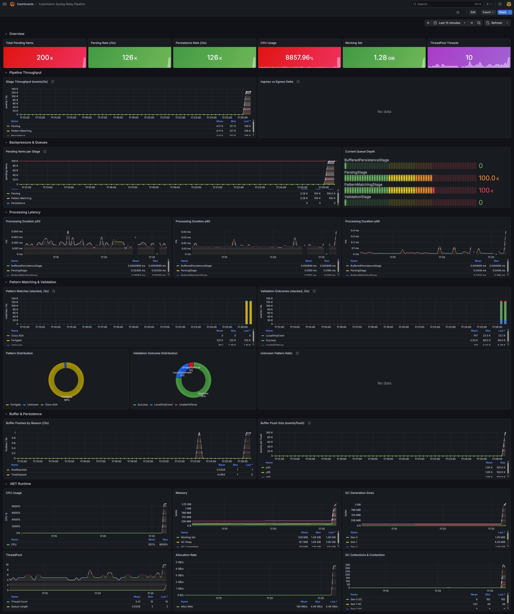

# Metrics

The sensor exposes internal pipeline metrics using the standard .NET `System.Diagnostics.Metrics` API. Metrics are **off by default** and collection has no effect on performance when not actively observed — you do not need to set any of this up for the sensor to function normally.

Most deployments will never need this. The sensor is designed to run unattended and its operational health is visible through its logs. Metrics are useful if you want to observe the volume of events flowing through the pipeline, identify back-pressure between stages, or track upload success rates over time — for example, when tuning capacity or investigating a performance issue.

---

## Available Metrics

**`CyberAlarm.SyslogRelay.Pipeline`** — processing pipeline

| Metric | Type | Tags | Description |
|--------|------|------|-------------|
| `pipeline.stage.processing_duration` (ms) | Histogram | `stage` | Time taken to process a single event in a stage |
| `pipeline.stage.items_processed` | Counter | `stage` | Total events processed by a stage |
| `pipeline.channel.pending_items` ({items}) | Gauge | `stage` | Events currently queued waiting to enter a stage |
| `pipeline.validation.outcomes` | Counter | `outcome` | Events classified by outcome: `Success`, `UnableToPatternMatch`, `UnableToParse`, `LocalOnlyEvent` |
| `pipeline.buffer.flushes` | Counter | `reason` | Buffer flushes by trigger: `SizeReached`, `TimeElapsed`, `StoppingStage` |
| `pipeline.buffer.flush_size` ({events}) | Histogram | — | Number of events written to disk per flush |

**`CyberAlarm.SyslogRelay.Upload`** — upload cycle

| Metric | Type | Description |
|--------|------|-------------|
| `upload.files_uploaded` | Counter | Files successfully uploaded to the platform |
| `upload.files_failed` | Counter | Files that failed to upload |
| `upload.cycle_duration` (ms) | Histogram | Total time for a complete upload cycle |

---

## Viewing Metrics Locally (without Docker)

The quickest way to inspect live metrics is with the `dotnet-counters` CLI tool. This requires the sensor to be running outside Docker, or with a writable diagnostic socket available.

Install the tool globally if you haven't already:

```bash
dotnet tool install --global dotnet-counters
```

Then, while the sensor is running, execute:

```bash
dotnet-counters monitor \
  --name CyberAlarm.SyslogRelay.ConsoleApp \
  --counters CyberAlarm.SyslogRelay.Pipeline,CyberAlarm.SyslogRelay.Upload
```

This prints a live table of all counters to your terminal, refreshing every second. No persistent storage, no dashboards — just a quick view into what the sensor is doing right now.

---

## Full Monitoring Stack with Grafana

For persistent visibility, you can add [dotnet-monitor](https://github.com/dotnet/dotnet-monitor), [Prometheus](https://prometheus.io/), and [Grafana](https://grafana.com/) alongside the sensor. This gives you a full dashboard with historical data and the ability to alert on anomalies.

This setup is entirely optional. The sensor does not require it, and running these additional services adds resource overhead and operational complexity. Only set this up if you have a specific reason to observe metrics over time.

### Docker Compose

The following replaces your standard `docker-compose.yaml`. It adds three new services — `dotnet-monitor`, `prometheus`, and `grafana` — alongside the sensor:

```yaml
services:
  syslog-relay:
    image: ghcr.io/waterstonsltd/cyberalarm-securesensor:stable
    container_name: syslog-relay
    restart: unless-stopped
    read_only: true
    security_opt:
      - no-new-privileges:true
    cap_drop:
      - ALL
    mem_limit: 2g
    mem_reservation: 1g
    cpus: 2
    pids_limit: 100
    volumes:
      - /docker/syslog:/var/lib/syslog-relay:rw
      - /docker/drop:/mnt/drop
      - diagvol:/diag
    ports:
      - 514:514/udp
      - 514:514/tcp
    environment:
      - REGISTRATION_TOKEN=${REGISTRATION_TOKEN}
      - DOTNET_DiagnosticPorts=/diag/dotnet-monitor.sock,nosuspend
      - Metrics__EnabledMetrics__CyberAlarm.SyslogRelay.Pipeline=true
      - Metrics__EnabledMetrics__CyberAlarm.SyslogRelay.Upload=true
    logging:
      driver: json-file
      options:
        max-size: 10m
        max-file: "3"

  dotnet-monitor:
    image: mcr.microsoft.com/dotnet/monitor:9
    command: collect --no-auth
    environment:
      - DOTNETMONITOR_DiagnosticPort__ConnectionMode=Listen
      - DOTNETMONITOR_DiagnosticPort__EndpointName=/diag/dotnet-monitor.sock
      - DOTNETMONITOR_Storage__DefaultSharedPath=/diag
      - DOTNETMONITOR_Metrics__Enabled=true
      - DOTNETMONITOR_Metrics__Meters__0__MeterName=CyberAlarm.SyslogRelay.Pipeline
      - DOTNETMONITOR_Metrics__Meters__1__MeterName=CyberAlarm.SyslogRelay.Upload
      - DOTNETMONITOR_Metrics__Endpoints=http://+:52325
    ports:
      - 52325:52325
    volumes:
      - diagvol:/diag

  prometheus:
    image: prom/prometheus:latest
    container_name: prometheus
    restart: unless-stopped
    ports:
      - 9090:9090
    volumes:
      - ./prometheus.yml:/etc/prometheus/prometheus.yml:ro
      - prometheus-data:/prometheus

  grafana:
    image: grafana/grafana:latest
    container_name: grafana
    restart: unless-stopped
    ports:
      - 3000:3000
    volumes:
      - grafana-data:/var/lib/grafana
    environment:
      - GF_SECURITY_ADMIN_PASSWORD=changeme

volumes:
  grafana-data:
  prometheus-data:
  diagvol:
    driver_opts:
      type: tmpfs
      device: tmpfs
      o: mode=1777
```

> **Important:** change `GF_SECURITY_ADMIN_PASSWORD` to a strong password before deploying.

You also need a `prometheus.yml` in the same directory as your Compose file. This tells Prometheus to scrape metrics from dotnet-monitor:

```yaml
global:
  scrape_interval: 15s

scrape_configs:
  - job_name: cyberalarm-sensor
    static_configs:
      - targets:
          - dotnet-monitor:52325
```

Start all services with:

```bash
docker compose up -d
```

---

### Setting Up the Grafana Dashboard

Once the stack is running, Grafana is available at `http://<your-host>:3000`. The default credentials are `admin` / `changeme` (or whatever you set in the Compose file).

#### 1. Add Prometheus as a data source

1. In the left sidebar, go to **Connections** → **Data sources**
2. Click **Add new data source**
3. Select **Prometheus**
4. Set the **Connection URL** to `http://prometheus:9090`
5. Scroll to the bottom and click **Save & test** — you should see a green confirmation

#### 2. Import the dashboard

A pre-built dashboard JSON is included in this repository at [`docs/metrics/dashboard.json`](dashboard.json).

1. In the left sidebar, go to **Dashboards**
2. Click **New** → **Import**
3. Click **Upload dashboard JSON file** and select `dashboard.json` from this repository
4. Under **Select a Prometheus data source**, choose the data source you just created
5. Click **Import**

The dashboard will open immediately and begin displaying live metrics as they are scraped.



---

### Forwarding to an OpenTelemetry backend

dotnet-monitor can push metrics directly to an OTLP endpoint (Grafana Cloud, Datadog, Azure Monitor, etc.) without requiring any changes to the sensor image. Add the following environment variables to the `dotnet-monitor` service:

```yaml
environment:
  - DOTNETMONITOR_Otlp__Endpoint=https://otlp.example.com
  - DOTNETMONITOR_Otlp__Headers__Authorization=Bearer <token>
```

Consult the [dotnet-monitor documentation](https://github.com/dotnet/dotnet-monitor/blob/main/docs/configuration.md) for the full list of supported exporters and authentication options.
